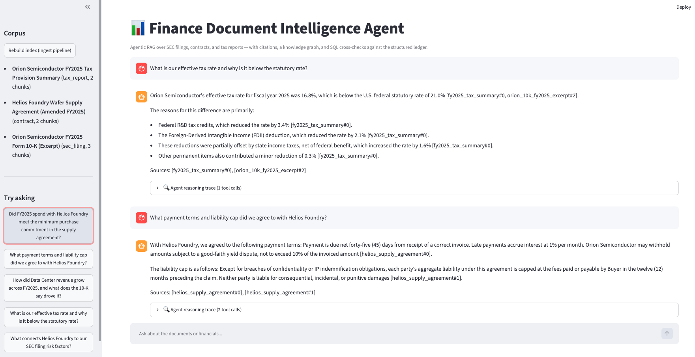
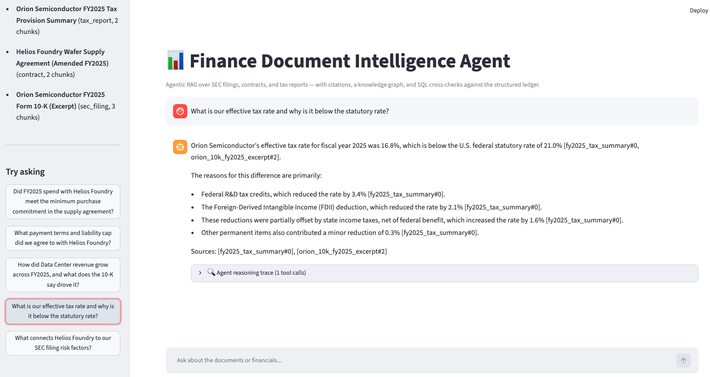

# Finance Document Intelligence Agent

Agentic RAG over financial documents — SEC filings, supplier contracts, and tax
reports — with **citations on every answer**, a lightweight **knowledge graph
(Graph-RAG)**, and a guard-railed **SQL tool** that lets the agent cross-check
unstructured claims against a structured ledger.

Built as a working reference for the "ingest unstructured documents → help
humans and AI agents search and perform multi-step reasoning across document
types" problem in finance data engineering.

## Screenshots

Every answer is grounded in retrieved evidence and cites its sources —
`[doc_id#chunk]` for document chunks, `[db:table]` for SQL results — with the
agent's full tool-call trace inspectable per answer:





## Architecture

```
data/raw/*.md|pdf
      │
      ▼
┌─────────────────────── Ingestion pipeline (pipeline.py) ───────────────────────┐
│ extract ─► validate (quality gate) ─► chunk ─► embed ─► index      lineage on  │
│                                    │                  (Chroma)     every chunk │
│                                    ├────────────────► knowledge graph (JSON)   │
│                                    └────────────────► SQLite ledger seed       │
└─────────────────────────────────────────────────────────────────────────────────┘
      │  each stage is a plain function → Airflow task (orchestration/)
      ▼
┌────────────────────────── Agent loop (agent.py) ───────────────────────────────┐
│ Gemini function calling, hand-written loop (observable, gateable):             │
│   search_documents  · get_document  · graph_lookup  · query_financials (RO)    │
│ Answers cite [doc_id#chunk] and [db:table]; refuses to answer from memory.     │
└─────────────────────────────────────────────────────────────────────────────────┘
      │
      ▼
Streamlit chat UI (app.py) with reasoning-trace inspector · CLI (cli.py)
```

**Multi-step reasoning demo** — ask: *"Did FY2025 spend with Helios Foundry
meet the minimum purchase commitment in the supply agreement?"* The agent
searches the contract for the commitment ($1,200M), runs
`SELECT SUM(spend_usd_m) ...` against the ledger ($1,220M), compares, and
answers with citations to both sources.

## Quickstart

```bash
cd finance_rag_agent
cp .env.example .env            # add your GOOGLE_API_KEY
uv sync                         # or: pip install -e . --group dev
uv run python cli.py ingest     # build index + graph + ledger
uv run python cli.py ask "What payment terms did we agree to with Helios?" --show-steps
uv run streamlit run app.py     # chat UI at localhost:8501
uv run pytest                   # offline test suite (no API key needed)
```

Docker:

```bash
docker build -t finance-rag-agent .
docker run -p 8501:8501 -e GOOGLE_API_KEY=... finance-rag-agent
```

## Design decisions (and the production path)

| Decision here | Why | At production scale |
|---|---|---|
| Idempotent upserts keyed on `doc_id#chunk` + content SHA-256 | Re-ingestion is retry-safe; no duplicates, no full rebuilds | Same pattern as Delta Lake `MERGE` incremental upserts |
| Quality gate *before* indexing (empty/dup/short-chunk expectations) | Bad chunks poison retrieval silently | Great Expectations / dbt tests as a blocking DAG task |
| Lineage metadata on every chunk (source path, source SHA-256, timestamp) | Every answer is traceable to an exact source version — audit-ready | Unity Catalog / OpenLineage |
| Declarative entity/relation extraction from doc front matter | Deterministic, testable graph build | LLM extraction pass writing to Neo4j / Spanner Graph |
| Read-only SQL tool: single-statement SELECT allowlist + read-only connection | Agents get least-privilege access to structured data | Warehouse service account with read-only grants (Snowflake/Databricks SQL) |
| Hand-written agent loop (no framework) | Every tool call observable, loggable, gateable | Add approval gates + OpenTelemetry traces |
| Embeddings via API (`gemini-embedding-001`), store is provider-agnostic | Swap embedder without touching the index code | Vector search in the warehouse (Snowflake Cortex / Databricks Vector Search) |
| Pipeline stages as plain functions | Unit-testable in isolation | Mapped 1:1 to Airflow tasks — see `orchestration/finance_rag_dag.py` |

## Repo layout

```
src/finance_rag/
  documents.py   loading, chunking, quality validation, lineage
  embedder.py    Gemini embeddings (injectable — tests use a fake)
  indexer.py     Chroma vector index, idempotent upserts
  graph.py       knowledge graph (Graph-RAG layer)
  findb.py       SQLite ledger + guard-railed read-only SQL
  tools.py       agent tool declarations + dispatch
  agent.py       Gemini function-calling loop
  pipeline.py    staged ingestion with quality gate
orchestration/   Airflow DAG wrapping the pipeline stages
data/raw/        sample corpus (synthetic 10-K, contract, tax report)
tests/           offline pytest suite (fake embedder, tmp stores)
app.py / cli.py  Streamlit chat UI / CLI
```

All corpus data is synthetic ("Orion Semiconductor") with numbers that
reconcile across the documents and the ledger, so cross-source questions have
verifiable answers.
